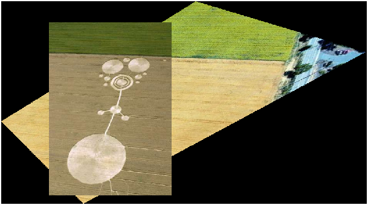
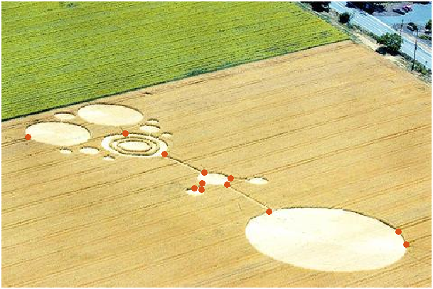
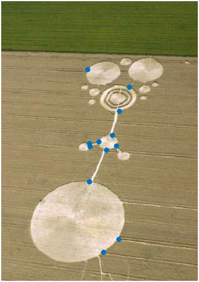
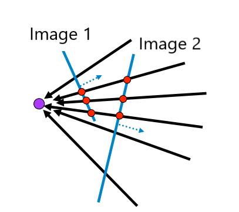
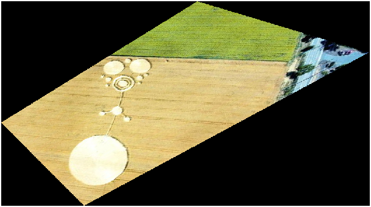

<h1 align='center' >Panoramic Stitcher</h1>

    
    
    

<h1></h1>

## Description

The panoramic stitcher allows you to combine multiple photos with overlapping content into a unified, panoramic image. The panoramic stitcher warps images such that they are in the same perspective and then merges the images together to achieve this panoramic effect.

## How it Works

### 1. Select Corresponding Points

Foremost, in order for the stitcher to combine multiple photos, it needs to know where overlapping content is located in the provided photos. Overlapping content is simply any visual content that can be seen in both photos. For example, two images that are to be stitched together may both contain the same chair. This chair is considered overlapping content, and it allows the panoramic stitcher to determine any differences in the two image's perspective.

In order to pinpoint overlapping content, the user manually selects corresponding points in the two images to be merged. The corresponding points are stored in two matrices `P1` and `P2` where `P1[n]` and `P2[n]` represent corresponding points in each image. The result of the process looks like this:

 

    
    
    
<b>Two images of the same crop circle marked with corresponding points</b>

 

### 2. Warp the Image

The images must now be altered such that they are in the same perspective. The same perspective, in our case, means that if you were to cast a ray from where you are standing through a point in one image, it would intersect with the corresponding point in the second image.

 

    
    
<b>The points of image 1 project onto corresponding points on image 2</b>

 

In order to achieve this, we shift the perspective of, or warp, image 1 (the first image input) to match the perspective of image 2. To do this, we find a mapping between the two sets of corresponding points `P1` and `P2`. This mapping is called a homography matrix, `H`, and is represented by the equation `P1 = H * P2`. We solve for `H` using simple linear algebra and then apply the homography matrix to image 1 via matrix product, effectively warping it. The result of a warp looks like this:

 

    
    
    
<b>The left image is the original and the right image is its warped counterpart</b>

 

### 3. Combine Images

Now that both images are in the same perspective, all that's left to do is to align the two images based on their corresponding points, thus merging the images. This process can be repeated with as many photos an desired. The end result looks like this:

 

    
    
    
<b>Image 1 (left) and Image 2 (right)</b>

    
    
<b>Merged Image</b>

 

## How to Use

1. Download Files in `./src`

2. Run `getCorrespondingPoints.m`. Two images are accepted as input

3. Run `computeH.m`

4. Run `warpImage.m`

